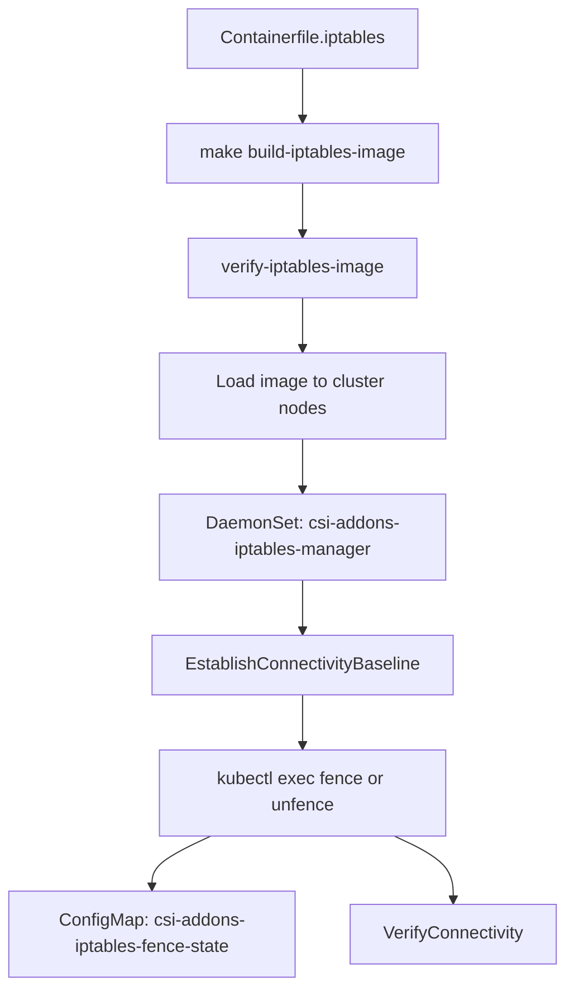

# Fault Injection Framework

This document describes the network fault injection framework implemented for end-to-end testing in the CSI-Addons project. The framework provides a vendor-agnostic approach to network fencing with multiple backend providers.

## Overview

The fault injection framework allows end-to-end tests to simulate network failures by blocking IP addresses or CIDR ranges. This is crucial for testing disaster recovery scenarios and replication behavior under network partition conditions.

## End-to-end flow (high level)

The diagram below summarizes how the **iptables** backend goes from a built image to verified fence/unfence. The **NetworkFence** backend skips the iptables image and DaemonSet; it drives the CSI `NetworkFence` API instead (see [NetworkFence fence and unfence validation](#networkfence-fence-and-unfence-validation)).

Many Markdown previews do not render Mermaid (or only support a narrow syntax). The **ASCII figure** is readable everywhere; the **Mermaid** block matches it and works in GitHub, GitLab, and editors with a Mermaid extension.

```text
iptables path (full-DR / local cluster)
=======================================

  Containerfile.iptables          loadImageToCluster() or
  (test/e2e/utils/)             Makefile load-images-to-clusters
           |                                    ^
           v                                    |
  make build-iptables-image  --------------------+
           |
           v
  verify-iptables-image (local image smoke test)
           |
           v
  Deploy DaemonSet  csi-addons-iptables-manager  (iptables-daemonset.yaml)
           |
           +------------------+------------------+
           | (iptables)       | (networkfence)  |
           v                  v                 optional parallel path
  EstablishConnectivityBaseline          poll NetworkFence CR
  (Job probes)                           Spec/Status + Result
           |
           v
  kubectl exec: OUTPUT/FORWARD REJECT or delete  ;  fence-state ConfigMap
           |
           v
  VerifyConnectivity (probe Jobs vs baseline)
```



_(The **networkfence** injector skips image load and DaemonSet; it uses `NetworkFence` CRs only—see the ASCII figure above and [NetworkFence fence and unfence validation](#networkfence-fence-and-unfence-validation).)_

## Architecture

The framework consists of several key components:

### 1. PeerFenceProvider Interface

The core interface that all fault injection backends must implement (see `test/e2e/helpers/fault_injection.go`):

```go
type PeerFenceProvider interface {
    FenceIP(ctx context.Context, targetCIDR string, params map[string]string) error
    UnfenceIP(ctx context.Context, targetCIDR string, params map[string]string) error

    // Iptables: short-lived Jobs (ping, ip route, traceroute). NetworkFence/NoOp: nil baseline.
    EstablishConnectivityBaseline(ctx context.Context, targetCIDR string) (*ConnectivityBaseline, error)

    // Semantics differ by provider — see iptables vs NetworkFence sections below.
    VerifyConnectivity(ctx context.Context, targetCIDR string, expectedFenced bool, baseline *ConnectivityBaseline) (bool, error)

    IsSupported(ctx context.Context) bool
    Cleanup(ctx context.Context) error
    GetProviderType() FaultInjectorType
}
```

### 2. Provider Implementations

#### IptablesFaultProvider

- Uses a privileged **DaemonSet** (`csi-addons-iptables-manager`) with `NET_ADMIN` / `NET_RAW`, **hostNetwork**, and **`imagePullPolicy: Never`** so the cluster must have the **pre-built** iptables-manager image loaded on nodes.
- **Fence/unfence** applies iptables rules by **`kubectl exec`** into each DaemonSet pod (OUTPUT and FORWARD chains, `REJECT --reject-with icmp-host-unreachable`), not by mutating a “rules” ConfigMap at runtime.
- Maintains a **fence state ConfigMap** (`csi-addons-iptables-fence-state`) listing active CIDRs for visibility—updated **before** applying REJECT when fencing paths that can cut off the API server.
- **Connectivity checks** use short-lived **Jobs** in the test namespace with the same image (ping, `ip route get`, optional traceroute).
- Requires cluster support for privileged DaemonSets.

#### NetworkFenceFaultProvider

- Uses **NetworkFence** and **NetworkFenceClass** CRs and waits for `Status.Result` after create/update.
- **Does not** run packet-level probe Jobs; replication tests assert peer behavior via **VolumeReplication** (and related) status.
- **VerifyConnectivity** compares expected fence state to the **NetworkFence** object (see below).

#### NoOpFaultProvider

- Default fallback provider when no specific backend is configured
- Always reports success but performs no actual operations
- Useful for testing the framework itself or when fault injection is not needed

### 3. Factory Function

The `NewFaultInjectionProvider()` function creates the appropriate provider based on:

- Environment variable `E2E_FAULT_INJECTOR` (see above) or an explicit `FaultInjectionConfig.Type`
- Invalid values return an error; **unsupported** backends are detected via `IsSupported(ctx)` (tests typically skip), not by silently switching to NoOp

## Environment Configuration

### Required Environment Variables

- `E2E_FAULT_INJECTOR`: Specifies which provider to use
  - **Unset** (default) — **`iptables`** (same as explicitly setting `iptables`)
  - `iptables` — Iptables-based fault injection via privileged DaemonSets
  - `networkfence` — NetworkFence CRDs (requires CSI-Addons controller and driver support)
  - `none` — NoOp provider (no real fault injection; tests skip partition scenarios)

### Optional Environment Variables (for iptables provider)

- `E2E_IPTABLES_TARGET_NODES`: Comma-separated list of node names where DaemonSets should run
- `E2E_IPTABLES_IMAGE`: Container image for the iptables DaemonSet and probe Jobs (default: `docker.io/csi-addons/iptables-manager:latest`)
- `E2E_IPTABLES_DAEMONSET_NAMESPACE`: Namespace where the suite looks for or deploys `csi-addons-iptables-manager`
- `E2E_IPTABLES_SKIP_SUITE_DS_RECREATE`: When `true`, `EnsureFreshSuiteIptablesDaemonSet` skips deleting an existing DaemonSet (faster when the image is already correct)

## Iptables image build and validation

Fault injection uses a **dedicated OCI image** built from Alpine with iptables and network tools baked in at **build** time. DaemonSet pods and probe Jobs must **not** run `apk`/`apt` at runtime.

### Build

- **Containerfile**: `test/e2e/utils/Containerfile.iptables` (copies `scripts/` into `/usr/local/bin`: `detect-iptables`, `fence-ip`, `unfence-ip`, etc.)
- **Makefile**: `test/e2e/utils/Makefile.iptables`

Common targets:

| Target                      | Purpose                                                                                                      |
| --------------------------- | ------------------------------------------------------------------------------------------------------------ |
| `build-iptables-image`      | Build and tag `csi-addons/iptables-manager:latest` and `docker.io/csi-addons/iptables-manager:latest`        |
| `verify-iptables-image`     | Assert the image exists locally and run `iptables --version` / `ip link show` inside it                      |
| `load-images-to-clusters`   | Load the image into **minikube** profiles `DR1_CONTEXT` / `DR2_CONTEXT` (default `dr1` / `dr2`)              |
| `verify-images-in-clusters` | Run a short-lived pod per context with `imagePullPolicy=Never` to confirm the image works **on the cluster** |
| `validate-network-fence`    | Run `validate-iptables-fence.sh` (full fence/unfence/datapath check)                                         |
| `test-e2e-flow`             | `build-iptables-image` → `load-images-to-clusters` → `validate-network-fence`                                |

Example:

```bash
make -f test/e2e/utils/Makefile.iptables build-iptables-image verify-iptables-image
```

`hack/run-replication-e2e.sh` can build the image automatically when the default tag is missing (see `E2E_IPTABLES_DIR` / `Containerfile.iptables` in that script).

### Validation scripts

- **`test/e2e/utils/prepare-iptables-image.sh`** — Tags `localhost/csi-addons/iptables-manager:latest` to `csi-addons/iptables-manager:latest` and sanity-checks with `podman|docker run … iptables --version`.
- **`test/e2e/utils/validate-iptables-fence.sh`** — End-to-end validation on a cluster: discovers an in-cluster target (kube-dns / API IP unless `VALIDATE_FENCE_TARGET` is set), proves reachability, fences, asserts iptables REJECT and datapath failure, then unfences and asserts restore. Invoked by `make validate-network-fence`.

Go code paths (`test/e2e/helpers/iptables_service.go`) call **`loadImageToCluster`** (minikube / kind / k3d) before deploying the DaemonSet when possible; if that fails, the image must already be present on nodes because **`imagePullPolicy` is `Never`**.

## DaemonSet and ConfigMap templates

Embedded templates live under `test/e2e/helpers/templates/` and are rendered by `IptablesFaultProvider` / suite helpers.

### Code validation: what is actually used for fence/unfence

This matches the current implementation in `test/e2e/helpers/iptables_provider.go` and `iptables_service.go`.

| Mechanism                                     | Fence/unfence?  | Notes                                                                                                                                                      |
| --------------------------------------------- | --------------- | ---------------------------------------------------------------------------------------------------------------------------------------------------------- |
| `kubectl exec` into DaemonSet pods            | Yes             | `executeIptablesCommand` applies OUTPUT/FORWARD `REJECT`; only datapath for rules.                                                                         |
| ConfigMap `csi-addons-iptables-fence-state`   | Written only    | History/visibility; not read to program iptables. Sync helpers: `syncFenceStateConfigMapPreApply`, `syncFenceStateConfigMap`, `deleteFenceStateConfigMap`. |
| ConfigMap `csi-addons-iptables-manager-rules` | No (tests only) | Template `iptables-configmap.yaml` rendered in `iptables_provider_test.go` only. Not created by `DeployIptablesServiceWithConfigMap` or `deployDaemonSet`. |
| batch/v1 `Job` (probes)                       | No              | `createConnectivityProbeJob` / `runConnectivityProbeJob` only for baseline and `VerifyConnectivity`.                                                       |
| Kubernetes Events + DaemonSet annotations     | Audit only      | `emitIptablesFenceEvent` does not drive fencing.                                                                                                           |

Emergency staged-rule cleanup uses **`createCleanupJob`**, which despite its name performs **exec into the DaemonSet pod**, not a batch Job.

| Resource             | Name (default)                      | Role                                                                                                      |
| -------------------- | ----------------------------------- | --------------------------------------------------------------------------------------------------------- |
| DaemonSet            | `csi-addons-iptables-manager`       | Privileged, hostNetwork; readiness via `/tmp/iptables-ready`; image from `E2E_IPTABLES_IMAGE` / defaults. |
| ConfigMap (template) | `csi-addons-iptables-manager-rules` | From `iptables-configmap.yaml`; not deployed by suite helpers; not the runtime rule engine.               |
| ConfigMap (runtime)  | `csi-addons-iptables-fence-state`   | Fence history and visibility; pre-apply write possible before REJECT. Not consumed to program iptables.   |

Suite bootstrap may call **`EnsureFreshSuiteIptablesDaemonSet`** → **`DeployIptablesServiceWithConfigMap`**.

It loads the image when possible, ensures the namespace, creates the **DaemonSet** from `iptables-daemonset.yaml`, and waits for readiness.
It does **not** apply `iptables-configmap.yaml`. The function name is historical; fence-state is created later by **`IptablesFaultProvider`** during `FenceIP` / `UnfenceIP`.

## Kubernetes Events, annotations, and viewing fence history (iptables)

The iptables provider records **fence / unfence / cleanup** steps as **Kubernetes Events** on the **`csi-addons-iptables-manager` DaemonSet**, plus **annotations** on that DaemonSet so a trail survives default Event TTL (~1 hour).

### What gets recorded

Implementation: `test/e2e/helpers/iptables_provider.go` (`emitIptablesFenceEvent`).

| Mechanism                  | Details                                                                                                  |
| -------------------------- | -------------------------------------------------------------------------------------------------------- |
| **Preferred API**          | **`events.k8s.io/v1`** `Event` objects (`GenerateName`: `iptables-fence-`), **Regarding** the DaemonSet. |
| **Fallback**               | **`core/v1`** `Event` if the newer API create fails (`InvolvedObject` = DaemonSet).                      |
| **Reporting controller**   | `csi-addons-e2e-iptables`                                                                                |
| **Action** (events.k8s.io) | `FenceStateChange`                                                                                       |
| **Type**                   | `Normal`                                                                                                 |

**Event reasons** (use these when filtering or grepping logs):

| Reason                         | When emitted                                                                                                                                     |
| ------------------------------ | ------------------------------------------------------------------------------------------------------------------------------------------------ |
| `IptablesFenceStarting`        | Immediately **before** applying OUTPUT/FORWARD REJECT (after ConfigMap pre-sync intent); message warns if the CIDR could break API access.       |
| `IptablesFenceApplied`         | After the fence rule is applied and fence-state ConfigMap is synced; message references `kubectl get configmap csi-addons-iptables-fence-state`. |
| `IptablesFenceRemoved`         | After **UnfenceIP** removes the REJECT rules for that CIDR.                                                                                      |
| `IptablesFenceTeardownCleanup` | End of **`Cleanup()`** (per-CIDR unfence, staged REJECT sweep, ConfigMap delete path).                                                           |

**DaemonSet annotations** (updated on every emit; inspect after Events expire):

- `csi-addons.io/e2e-iptables-last-reason` — last **Reason** string
- `csi-addons.io/e2e-iptables-last-utc` — RFC3339Nano timestamp
- `csi-addons.io/e2e-iptables-last-summary` — truncated message (single line)

Example:

```bash
kubectl -n csi-addons-system get daemonset csi-addons-iptables-manager -o yaml | grep csi-addons.io/e2e-iptables
```

### Validation and debugging

- **Ordering**: `IptablesFenceStarting` is emitted **before** iptables runs so an audit trail exists even if the next API calls fail (e.g. fencing the control-plane path).
- **Cross-check**: Compare Event sequence with **`csi-addons-iptables-fence-state`** ConfigMap and probe Job logs in the workload namespace.
- **NetworkFence backend**: does **not** use these DaemonSet Events; validate via **`NetworkFence` `Status.Result`** and CR fields (see [NetworkFence fence and unfence validation](#networkfence-fence-and-unfence-validation)).

### Make target: print DaemonSet Events (DR1 / DR2)

The repository root **Makefile** exposes a target that prints the **Events** section from **`kubectl describe daemonset`** for the iptables manager on both replication contexts (same defaults as the helper code):

```bash
make show-e2e-iptables-fence-events
```

This runs **`hack/show-e2e-iptables-fence-events.sh`**, which extracts the `Events:` block from `kubectl describe` for **DR1** and **DR2**.

Overridable variables (passed through by the Makefile):

| Variable                           | Default                       |
| ---------------------------------- | ----------------------------- |
| `E2E_IPTABLES_DAEMONSET_NAMESPACE` | `csi-addons-system`           |
| `E2E_IPTABLES_DAEMONSET_NAME`      | `csi-addons-iptables-manager` |
| `DR1_CONTEXT`                      | `dr1`                         |
| `DR2_CONTEXT`                      | `dr2`                         |

Direct script invocation:

```bash
E2E_IPTABLES_DAEMONSET_NAMESPACE=my-ns DR1_CONTEXT=dr1 DR2_CONTEXT=dr2 bash ./hack/show-e2e-iptables-fence-events.sh
```

To list **Event** objects via the API (not only the describe summary):

```bash
kubectl get events -n csi-addons-system --field-selector involvedObject.name=csi-addons-iptables-manager
# events.k8s.io/v1 resources may appear as separate objects depending on cluster/version; use:
kubectl get events.events.k8s.io -n csi-addons-system 2>/dev/null || true
```

## Usage in Tests

### Basic Setup

```go
import "github.com/csi-addons/kubernetes-csi-addons/test/e2e/helpers"

// Create provider
config := helpers.FaultInjectionConfig{
    Client:    k8sClient,
    Namespace: "test-namespace",
}

provider, err := helpers.NewFaultInjectionProvider(config)
if err != nil {
    return err
}

// Check if provider is supported in this cluster
if !provider.IsSupported(ctx) {
    Skip("Fault injection not supported in this cluster")
}

// Cleanup resources when done
defer provider.Cleanup(ctx)
```

### Network Fencing Operations

Iptables-backed tests typically establish a **baseline** before fencing (so `VerifyConnectivity` can compare before/after when ICMP is selectively blocked):

```go
baseline, err := provider.EstablishConnectivityBaseline(ctx, "192.168.1.100/32")
if err != nil {
    return err
}

err = provider.FenceIP(ctx, "192.168.1.100/32", map[string]string{
    "reason": "testing-network-partition",
})
// ...

fenced, err := provider.VerifyConnectivity(ctx, "192.168.1.100/32", true, baseline)
if err != nil || !fenced {
    // Handle error or unexpected connectivity
}

err = provider.UnfenceIP(ctx, "192.168.1.100/32", nil)

restored, err := provider.VerifyConnectivity(ctx, "192.168.1.100/32", false, baseline)
```

For **NetworkFence**, skip baseline (always `nil`) and assert fence state via the CR or VolumeReplication conditions in the suite.

### Suite-Level Integration

The framework integrates with the BeforeSuite/AfterSuite lifecycle:

```go
var _ = BeforeSuite(func() {
    // Capability detection is performed automatically
    privilegedDaemonSetCached = helpers.HasPrivilegedDaemonSetSupport(ctx, k8sClient)
})

var _ = AfterSuite(func() {
    // Emergency cleanup is handled by provider.Cleanup()
})
```

## Capability Detection

The framework automatically detects cluster capabilities:

### For Iptables Provider

- Tests ability to create privileged DaemonSets with NET_ADMIN capabilities
- Verifies security policies allow privileged containers
- Checks for required node operating system support

### For NetworkFence Provider

- Examines CSIAddonsNode resources for NetworkFence capability
- Validates NetworkFence CRDs are installed
- Confirms CSI-Addons controller is available

## NetworkFence fence and unfence validation

The **NetworkFence** provider validates operations through the **NetworkFence API** and **CSIAddonsNode** capability checks—not through ICMP Jobs.

### Fence (`FenceIP`)

1. Validates CIDR and required **NetworkFence** secrets (from params / environment).
2. Creates a **NetworkFenceClass** (provisioner + secret parameters) and a **NetworkFence** with `FenceState: Fenced` and the target CIDRs.
3. **`waitForNetworkFenceResult`**: polls until `Status.Result == FencingOperationResultSucceeded` (2s interval, up to ~120s). If that never succeeds, `FenceIP` returns an error.

### Unfence (`UnfenceIP`)

1. Finds the tracked **NetworkFence** for the CIDR, sets `Spec.FenceState` to **Unfenced**, updates the object.
2. Again **`waitForNetworkFenceResult`** until `Status.Result == FencingOperationResultSucceeded`.

### `VerifyConnectivity` (NetworkFence)

- **Ignores** `baseline` (packet probes are iptables-only).
- If there is **no** active tracked fence for the CIDR: returns success when `expectedFenced == false` (path is “open”).
- If a fence exists: **GET** the live `NetworkFence` and compute:

  `currentlyFenced := (Spec.FenceState == Fenced) && (Status.Result == FencingOperationResultSucceeded)`

- Returns whether `currentlyFenced` matches **`expectedFenced`**.

So “validation” here means **CR status matches the intended fence state**, not raw ping to the CIDR. End-to-end replication tests still observe data path behavior via **VolumeReplication** and related resources.

## Implementation Details

### Iptables Provider Technical Details

1. **DaemonSet**: Privileged DaemonSet with `NET_ADMIN` / `NET_RAW`, host network, tolerations for all taints, readiness once `/tmp/iptables-ready` exists after `detect-iptables` succeeds.

2. **Rule application**: **`kubectl exec`** into each DaemonSet pod runs shell that selects a working iptables binary, then inserts/deletes **OUTPUT** and **FORWARD** `REJECT` rules (`-C` check before `-I` where applicable).

3. **Fence state ConfigMap** (`csi-addons-iptables-fence-state`): updated for observability and ordering relative to API reachability—not the primary rule engine.

4. **Connectivity verification**:
   - **`EstablishConnectivityBaseline`**: creates a short-lived **Job** using the iptables image; parses `CSI_BASELINE` (ping / `ip route` / traceroute flags). Fails if **no** probe succeeded (cannot interpret fence).
   - **`VerifyConnectivity`**: runs another probe Job and compares to **baseline** when provided (`CompareProbeResultsToBaseline`); without baseline, “reachable” means **any** probe succeeded (handles clusters where ICMP is dropped).

### NetworkFence Provider Technical Details

1. **CRD integration**: Creates **NetworkFenceClass** and **NetworkFence** resources.
2. **Status monitoring**: **`waitForNetworkFenceResult`** polls `Status.Result` after create/update.
3. **Capability detection**: Lists **NetworkFence** / **NetworkFenceClass** CRDs and requires a **CSIAddonsNode** for the configured provisioner with **NETWORK_FENCE** capability.

## Testing Strategy

The framework includes comprehensive integration tests covering:

- Provider capability detection and fallback behavior
- Basic fence/unfence operations with connectivity verification
- Multiple target handling and cleanup
- Error conditions and invalid input handling
- Environment variable configuration testing

**Unit tests** for provider wiring and env parsing: `test/e2e/helpers/fault_injection_test.go` (standard `go test`, not Ginkgo).

### Running Tests

```bash
# Helpers package (includes fault_injection_test.go)
go test ./test/e2e/helpers/ -count=1 -short

# Replication E2E (example — use project Makefile / hack scripts for full suite)
E2E_FAULT_INJECTOR=iptables go test ./test/e2e/replication/ -count=1

E2E_FAULT_INJECTOR=networkfence go test ./test/e2e/replication/ -count=1

E2E_FAULT_INJECTOR=none go test ./test/e2e/replication/ -count=1
```

## Security Considerations

### Iptables Provider

- Requires privileged container capabilities
- Uses NET_ADMIN for iptables rule manipulation
- Should only be used in test environments
- DaemonSet pods have broad network access

### NetworkFence Provider

- Uses standard RBAC permissions
- Relies on CSI-Addons controller for actual implementation
- More suitable for production-like testing environments

## Troubleshooting

### Common Issues

1. **"Provider not supported"**

   - Check cluster security policies for privileged containers (iptables)
   - Verify CSI-Addons controller is running (networkfence)
   - Ensure correct environment variable configuration

2. **"DaemonSet creation failed"**

   - Check RBAC permissions for test service account
   - Verify node selectors and tolerations
   - Review security context constraints (OpenShift)

3. **"Connectivity verification failed"**
   - Ensure test cluster has internet access for ping targets
   - Check if firewall rules interfere with test traffic
   - Verify pod networking configuration

### Debugging Commands

```bash
# Check privileged DaemonSet support
kubectl auth can-i create daemonsets --as=system:serviceaccount:test:default

# Examine iptables DaemonSet logs
kubectl logs -n test-namespace -l app=csi-addons-iptables-manager

# Iptables fence/unfence Events on DR1+DR2 (see "Kubernetes Events" section above)
make show-e2e-iptables-fence-events

# Check NetworkFence resources
kubectl get networkfence,networkfenceclass -n test-namespace

# View CSIAddonsNode capabilities
kubectl get csiaddonsnode -o yaml
```

## Future Enhancements

Potential improvements to the framework:

1. **Additional Providers**: Support for other fault injection mechanisms (tc, network policies)
2. **Advanced Rules**: Port-specific filtering, bandwidth limiting, latency injection
3. **Observability**: Metrics and tracing for fault injection operations
4. **Declarative Config**: YAML-based configuration for complex scenarios
5. **Recovery Testing**: Automatic verification of system recovery after unfencing

## Contributing

When adding new providers or modifying existing ones:

1. Implement the `PeerFenceProvider` interface completely
2. Add comprehensive capability detection logic
3. Include proper resource cleanup in `Cleanup()` method
4. Add integration tests covering error conditions
5. Update this documentation with configuration details

For questions or issues related to the fault injection framework, please refer to the project's issue tracker or contact the maintainers.
